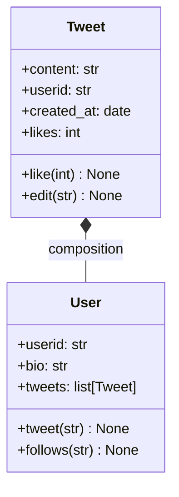

---
{"dg-publish":true,"dg-home":false,"permalink":"/1-school/winter-2023/csc-148/lecture-notes/week-2-1-classes/","dgPassFrontmatter":true}
---

## Accessing an instance attribute
```python
def f(self, x):
	# Must use self to get at instance attributes
	y = expression # Incorrect
	self.y = expression # Correct
```
Related Worksheet: [[1️⃣ School 🎓/Winter 2023/CSC148/Class Worksheets/Week 2.1 ws-OOP1\|Week 2.1 ws-OOP1]]

&nbsp;

## Re-assigning self
```python
def mutate(self, x):
	# Re-assigning self doesn’t mutate anything!
	self = NewObject(x)
```
Related Worksheet: [[1️⃣ School 🎓/Winter 2023/CSC148/Class Worksheets/Week 2.1 ws-OOP1\|Week 2.1 ws-OOP1]]

&nbsp;

## Composition of Classes
- **Definition**: A relationship between two classes where instances of one class contain references to instances of the other
- Link to worksheet example: [[1️⃣ School 🎓/Winter 2023/CSC148/Class Worksheets/Week 2.2 ws-OOP2\|Week 2.2 ws-OOP2]]
	-  UML Class Diagram (Just for understanding)


