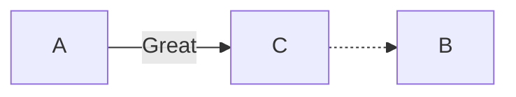
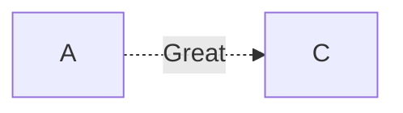
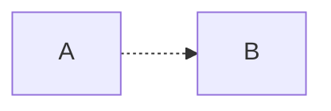
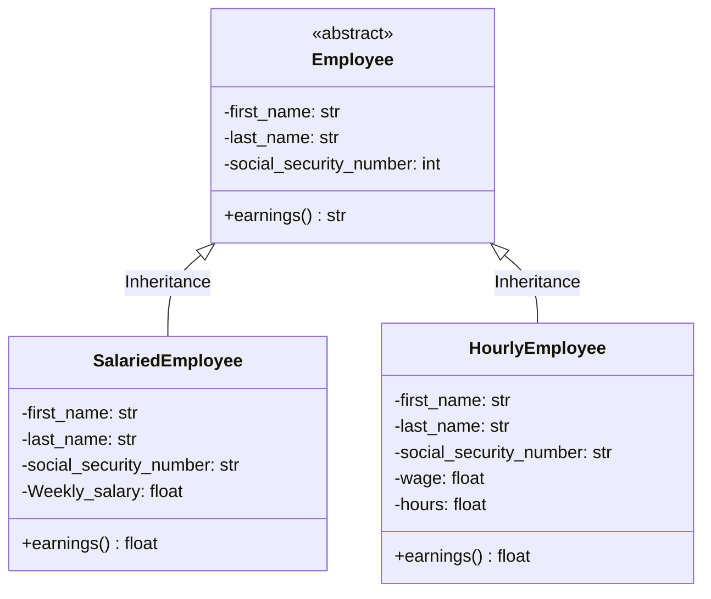
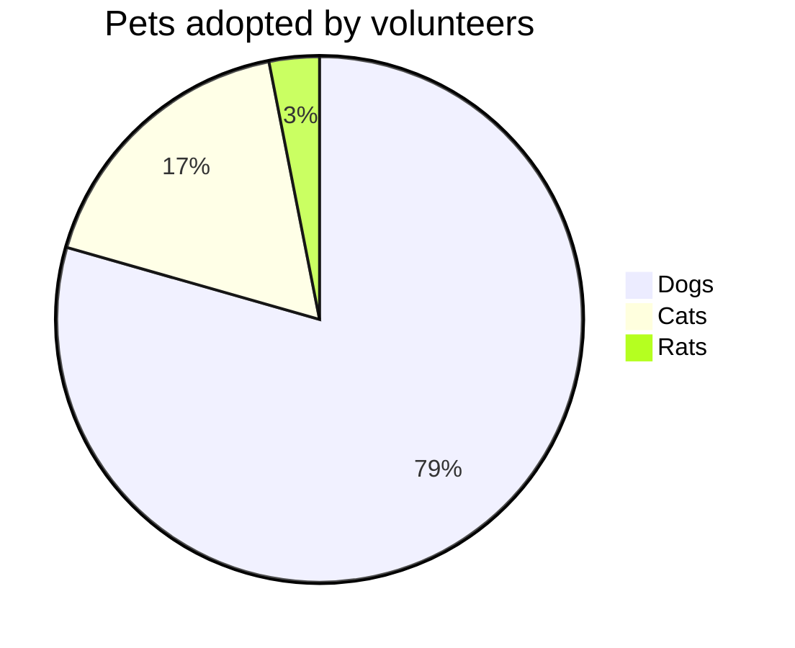
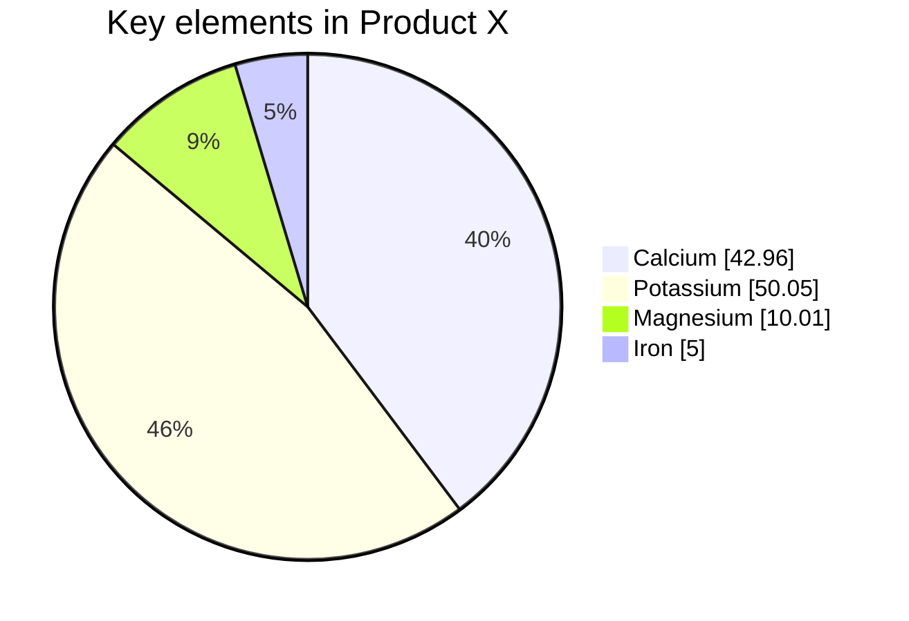
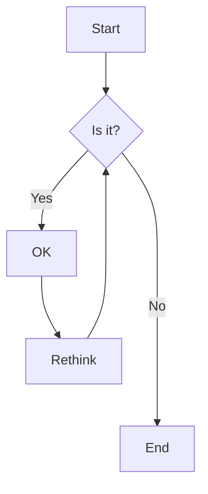
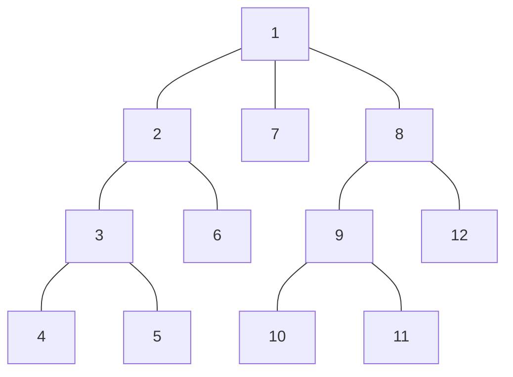
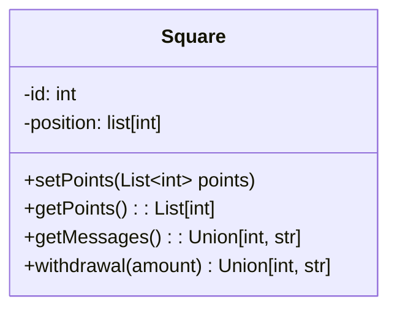

---
{"dg-publish":true,"dg-home":false,"permalink":"/2-general/general-notes/mermaid/","dgPassFrontmatter":true}
---

















```mermaid1
classDiagram 
classA --|> classB : Inheritance 
classC --* classD : Composition 
classE --o classF : Aggregation 
classG --> classH : Association 
classI -- classJ : Link(Solid) 
classK ..> classL : Dependency 
classM ..|> classN : Realization 
classO .. classP : Link(Dashed)
```