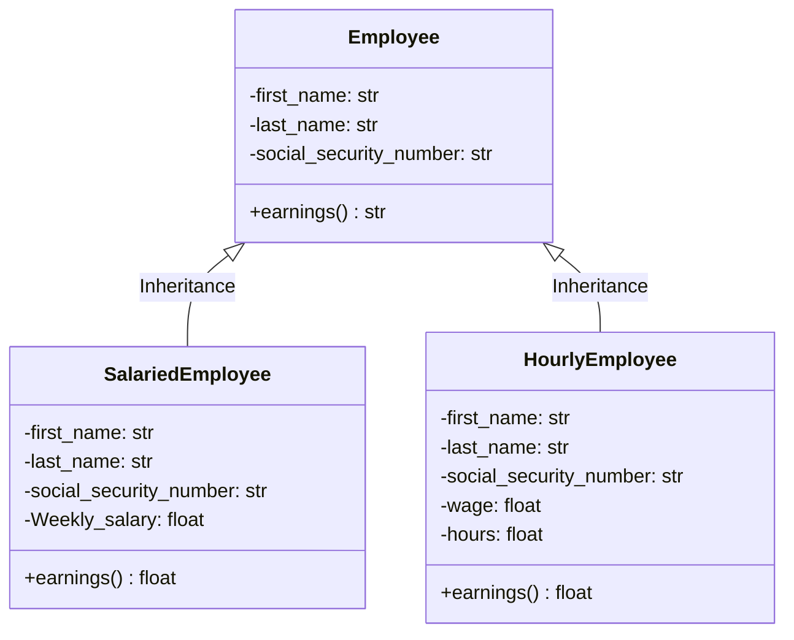

---
{"dg-publish":true,"permalink":"/3-drafts/test/"}
---

```mermaid
classDiagram
direction TD
	Employee <|-- SalariedEmployee: Inheritance
	Employee <|-- HourlyEmployee: Inheritance
	class Employee{
		-first_name: str
		-last_name: str
		-social_security_number: str
		+earnings() str 
		}
	class SalariedEmployee{
		-first_name: str
		-last_name: str
		-social_security_number: str
		-Weekly_salary: float  
		+earnings() float
	}
	class HourlyEmployee{
		-first_name: str
		-last_name: str
		-social_security_number: str
		-wage: float
		-hours: float
		+earnings() float
	}
```
